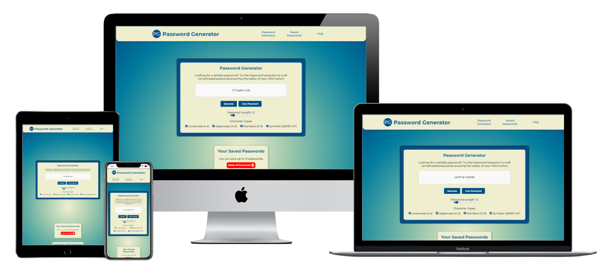
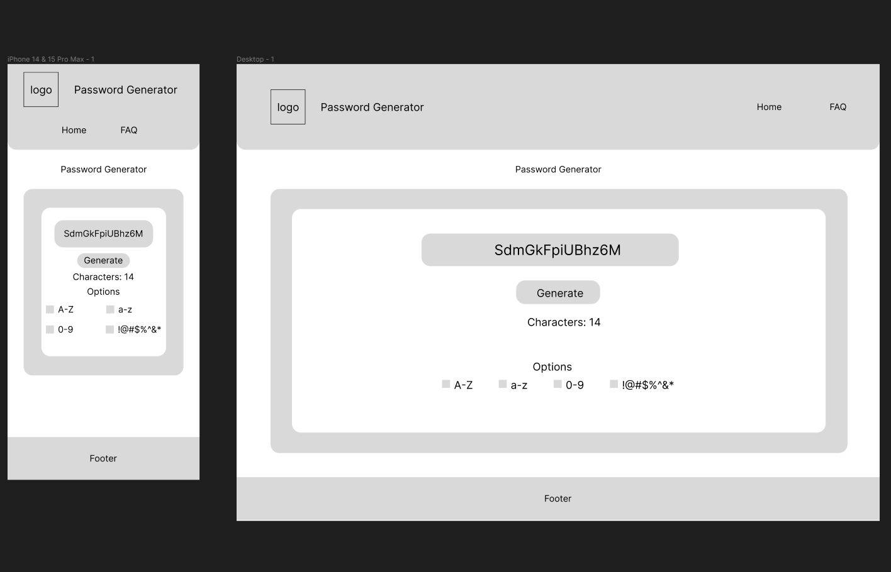
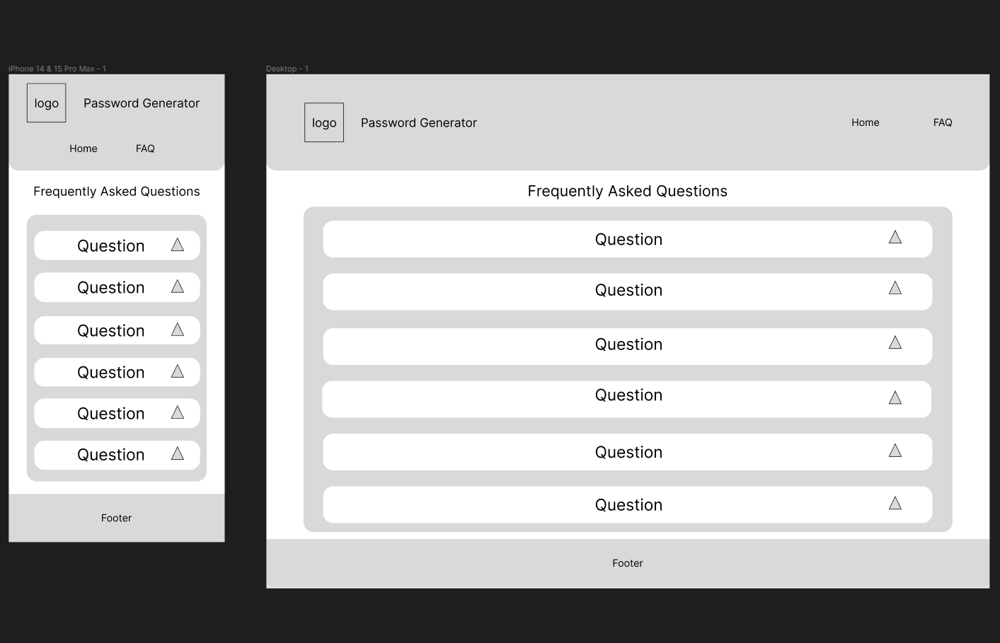
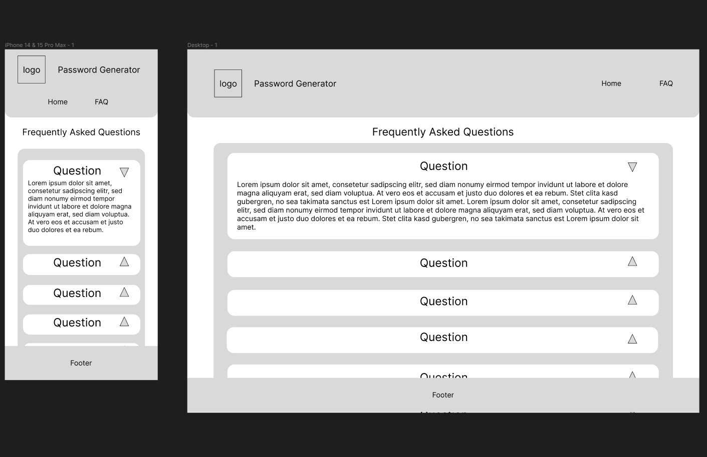
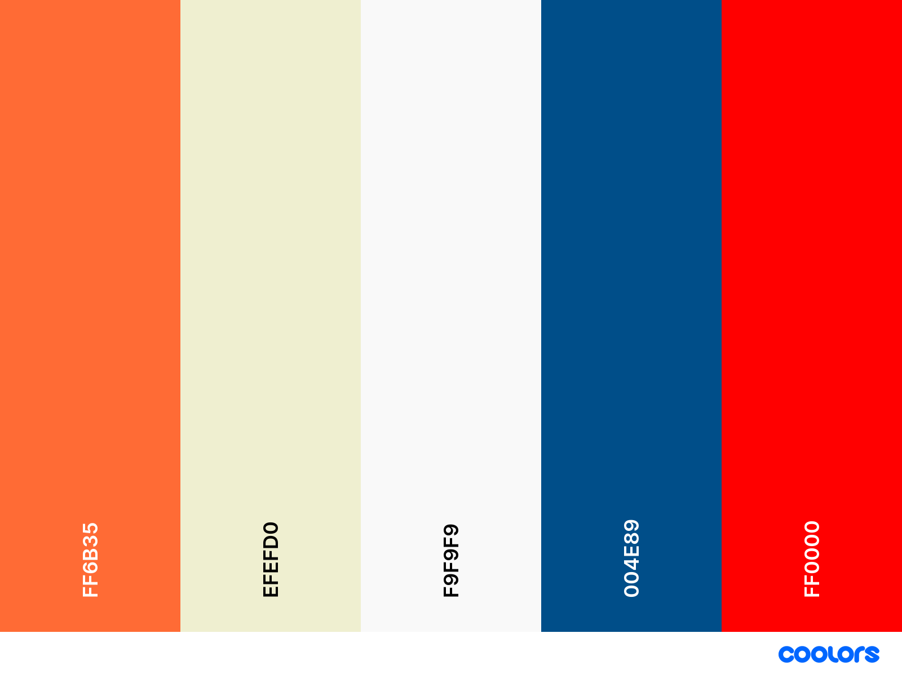

# Password Generator

In the digital age, a password generator is an essential tool. Its main purpose is to enhance online security by creating strong, random passwords. By combining letters, numbers, and special characters, password generators output unique and complex passwords that are very difficult to crack. These passwords act as the first line of defence against unauthorized access to sensitive information, protecting personal data, bank accounts, and confidential documents. It's not just convenient but rather necessary for people and institutions to encounter sort of password generator in this age of cyber attacks, which guarantees a bit of mind when the world is more and more interconnected.

Visit the deployed website here → [Password Generator](https://enniovilla.github.io/project-2-ci/index.html)

## Content

* [User Experience](#user-experience-ux)
    * [User Stories](#user-stories)
* [Design](#design)
    * [Website Structure](#website-structure)
    * [Wireframes](#wireframes)
    * [Color Scheme](#color-scheme)
    * [Typography](#typography)
* [Features and Future Features](#features-and-future-features)
    * [Features](#features)
    * [Future Features](#future-features)
* [Technologies Used](#technologies-used)
* [Deployment, Fork and Clone](#deployment-fork-and-clone)
    * [Deployment](#deployment)
    * [Fork](#how-to-fork)
    * [Clone](#how-to-clone)
* [Testing](#testing)
* [Bugs](#bugs)
    * [Known Bugs](#known-bugs)
* [Credits](#credits)
* [Content](#content)
* [Media](#media)
* [Acknowledgments](#acknowledgments)

## User Experience (UX)

### User Stories

#### First Time User

* I want to generate a safe and strong password.

#### Returning User

* I need a new password.

[Back to top](<#content>)

## Design

### Website Structure

I wanted to create a website with 3-4 pages, but when I got to the end and saw the finished work, it made more sense to create just one page divided into sections, since the website isn't that big and doesn't have that much content.

The html on my website contains three sections: the password generator section, the saved passwords section and the frequently asked questions section. These sections are one below the other, making the navigation of the website much smoother and more dynamic.

### Wireframes

I created wireframes for mobile and desktop using Figma. Click on the button below to see them.

Wireframes

  
Home page 

  
FAQ page 

  
Courses page 

### Color Scheme

- I used the color `#FCDAD7` in the navigation bar.
- I used the color `#F05244` for the edges of the containers on every page of the website. This color also appears when the user hovers over the buttons and the posters on the main page.
- The gradient in the background is made with the colors `#26174B` and `#FCDAD7`.
- On the buttons I chose `#AB2D8` to be the color.
- The logo has three colors: `#F05244`, `#AB2D8` and `#5E276F`.

### Typography

The font I chose to use is [Montserrat](https://fonts.google.com/specimen/Montserrat) from Google Fonts and as a fall back font, sans-serif.

[Back to top](<#content>)

## Features and Future Features

### Features

### The Home Page

### The About Us Page

### The Courses Page

### Gallery Page

### Contact Page

### Sign Up Page

### Form Submitted Page

### Future Features

[Back to top](<#content>)

## Technologies Used

- HTML5 to create the website structure.
- CSS3 to style the website.
- JavaScript to create the interactions on the website.
- [Git](https://git-scm.com/) for version control.
- [GitPod](https://www.gitpod.io/) as IDE to create the website.
- [GitHub](https://github.com/) to store files for the website.
- [Figma](https://www.figma.com/) to create the wireframes.
- [Chat GPT](https://chat.openai.com/) to generate the paragraphs on the FAQ page.
- [Google Fonts](https://fonts.google.com/) to import the font used on the website.
- [Favicon.io](https://favicon.io/) to create favicon.
- [Am I Responsive?](https://ui.dev/amiresponsive) to display the website image across various devices.
- [Font Awesome](https://fontawesome.com/) to add icons on the website.
- [Pixelied](https://pixelied.com/) to convert images to WebP.
- [Tinify](https://tinypng.com/) to compress images.
- [Appetize.io](https://appetize.io/) to simulate the iOS environment.

[Back to top](<#content>)

## Deployment, Fork and Clone

### Deployment

1. Log in to GitHub.
2. Go to the repository for the project.
3. Click the settings button.
4. Select **Pages** in the left navigation menu under Code and Automation.
5. From the source dropdown select main branch and root. Press the save button.
6. The site has been deployed. It may take a few minutes before the site goes live.

### How to Fork

1. Log in to GitHub.
2. Go to the repository for the project.
3. Click the Fork button in the top right corner.

### How to Clone

1. Log in to GitHub.
2. Go to the repository for the project.
3. Click on the **green code button** and select if you would like to clone with HTTPS, SSH or GitHub CLI and copy the link below.
4. Navigate to the directory where you want to clone the repository and open terminal.
5. Type *git clone* into the terminal and paste the link you have from number 3. Press enter. This command will download the entire repository to your local machine.

[Back to top](<#content>)

## Testing

Performed tests can be found in [TESTING.md](TESTING.md).

[Back to top](<#content>)

## Bugs

### Known Bugs

[Back to top](<#content>)

## Credits

## Content

## Media

## Acknowledgments

[Back to top](<#content>)