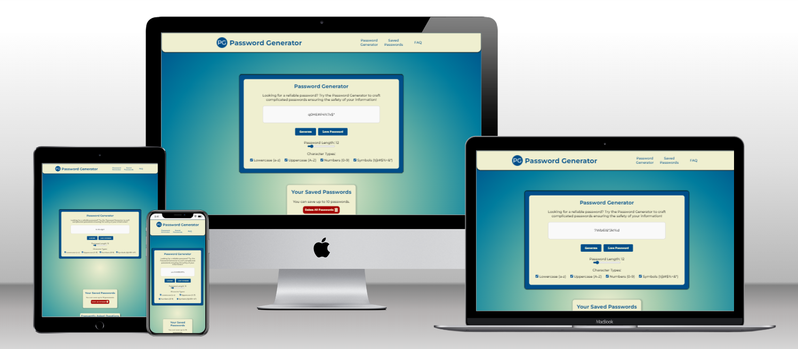
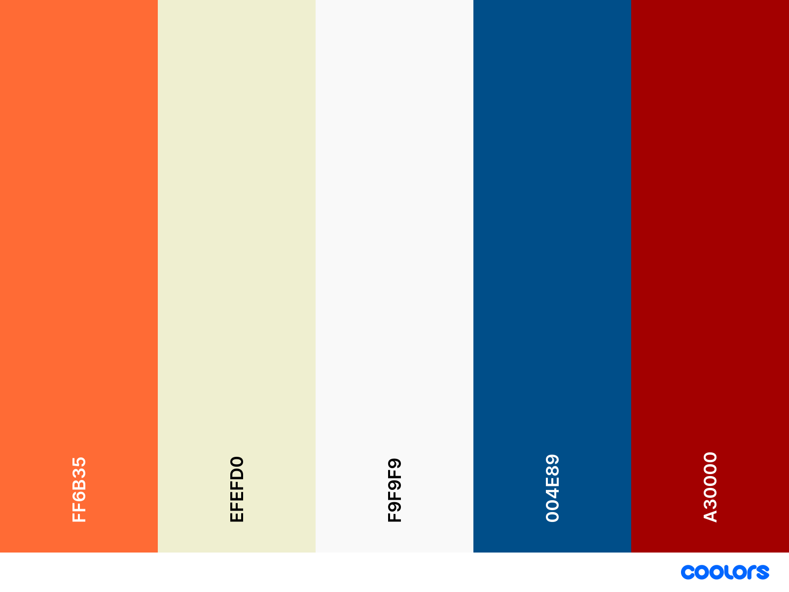
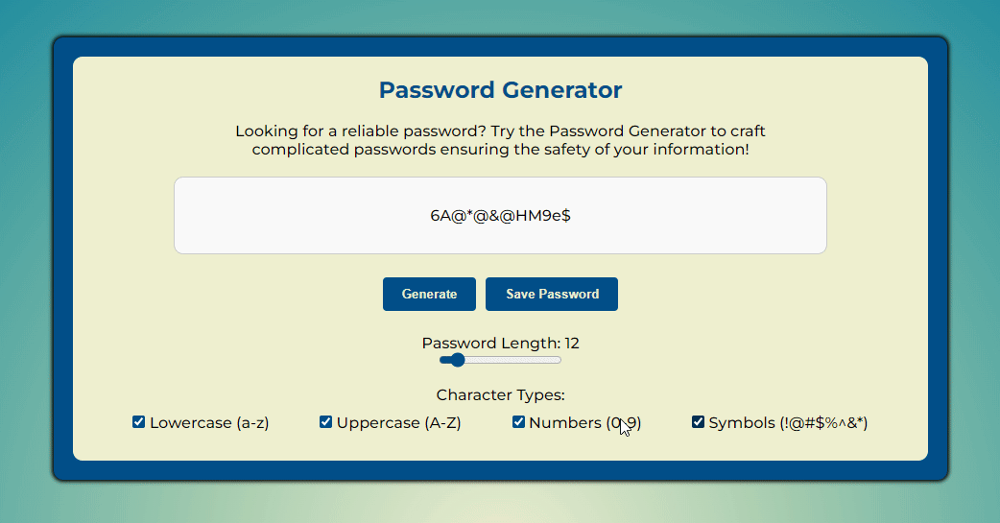

# Password Generator

In the digital age, a password generator is an essential tool. Its main purpose is to enhance online security by creating strong, random passwords. By combining letters, numbers, and special characters, password generators output unique and complex passwords that are very difficult to crack. These passwords act as the first line of defence against unauthorized access to sensitive information, protecting personal data, bank accounts, and confidential documents. It's not just convenient but rather necessary for people and institutions to encounter sort of password generator in this age of cyber attacks, which guarantees a bit of mind when the world is more and more interconnected.

Visit the deployed website here → [Password Generator](https://enniovilla.github.io/project-2-ci/index.html)

## Contents

* [User Experience](#user-experience-ux)
* [Design](#design)
    * [Website Structure](#website-structure)
    * [Wireframes](#wireframes)
    * [Color Scheme](#color-scheme)
    * [Typography](#typography)
* [Features and Future Features](#features-and-future-features)
    * [Features](#features)
    * [Future Features](#future-features)
* [Technologies Used](#technologies-used)
* [Deployment, Fork and Clone](#deployment-fork-and-clone)
    * [Deployment](#deployment)
    * [Fork](#how-to-fork)
    * [Clone](#how-to-clone)
* [Tests and Bugs](#tests-and-bugs)
    * [Tests](#tests)
    * [Bugs](#bugs)
* [Credits](#credits)
    * [Learning Methods and Code Used](#learning-methods-and-code-used)
    * [Content](#content)
    * [Media](#media)
    * [Acknowledgments](#acknowledgments)

## User Experience (UX)

### User Stories

#### First Time User

* I want to generate a safe and strong password.

#### Returning User

* I need a new password.

[Back to top](<#contents>)

## Design

### Website Structure

I wanted to create a website with 3-4 pages, but when I got to the end and saw the finished work, it made more sense to create just one page divided into sections, since the website isn't that big and doesn't have that much content.

The html on my website contains three sections: the password generator section, the saved passwords section and the frequently asked questions section. These sections are one below the other, making the navigation of the website much smoother and more dynamic.

There is another html file in the directory for the 404 error, which has been styled to match my website if a 404 error occurs.

### Wireframes

I created wireframes for mobile and desktop using Figma. Click on the button below to see them.

Wireframes

  
Home page 

  
FAQ page 

  
Question container opened 

### Color Scheme

I wanted this website to be clean and simple so I chose a contrast of light and dark colors.

- the most used colors were `#EFEFD0` and `#004E89`, which also make up the background gradient.
- `#A30000` was chosen as the color to represent the delete buttons.
- `#F9F9F9` is the color of the password display, making the background not so aggressive because of the white, but at the same time light enough to make the color of the characters stand out.
- The hover of the main buttons is colored `#FF6B35`, giving a nice contrast to them.

### Typography

The font I chose to use is [Montserrat](https://fonts.google.com/specimen/Montserrat) from Google Fonts and as a fall back font, sans-serif.

[Back to top](<#contents>)

## Features and Future Features

### Features

This is a single page website that includes three sections: Password Generator, Saved Passwords and Frequently Asked Questions.

As soon as the user opens the website, he is presented with:

- A favicon.  
  

- The menu.  
  

- The password generator which contains a button to generate a new password, a button to save the password, a range bar to adjust the length of the password and checkboxes to select which type of character they want in the password.  
  

- The saved passwords area where the user can save up to 10 passwords. This area contains a button to delete all passwords at once and each time a password is generated, it is generated with an icon to delete the password singularly.  
  

- The frequently asked questions section which is an accordion, saving space on the screen.  
  

- 404 error page.  
  

### Future Features

In the future I would like to add a login page, sign up page and dashboard, so the user can control the passwords a little better and make them safe. The plan is to turn this website into a password manager.

[Back to top](<#contents>)

## Technologies Used

- HTML5 to create the website structure.
- CSS3 to style the website.
- JavaScript to create the interactions on the website.
- [Git](https://git-scm.com/) for version control.
- [GitPod](https://www.gitpod.io/) as IDE to create the website.
- [GitHub](https://github.com/) to store files for the website.
- [Figma](https://www.figma.com/) to create the wireframes.
- [Chat GPT](https://chat.openai.com/) to generate the paragraphs on the FAQ section.
- [Google Fonts](https://fonts.google.com/) to import the font used on the website.
- [Favicon.io](https://favicon.io/) to create favicon.
- [Multi Device Website Mockup Generator](https://techsini.com/multi-mockup/) to display the website across multiple devices.
- [Font Awesome](https://fontawesome.com/) to add icons on the website.
- [Appetize.io](https://appetize.io/) to simulate the iOS environment.
- [WebAIM](https://webaim.org/resources/contrastchecker/) to check the contrast on my html and improve accessibility.
- [SweetAlert](https://sweetalert2.github.io/) to style the alert messages.

[Back to top](<#contents>)

## Deployment, Fork and Clone

### Deployment

1. Log in to GitHub.
2. Go to the repository for the project.
3. Click the settings button.
4. Select **Pages** in the left navigation menu under Code and Automation.
5. From the source dropdown select main branch and root. Press the save button.
6. The site has been deployed. It may take a few minutes before the site goes live.

### How to Fork

1. Log in to GitHub.
2. Go to the repository for the project.
3. Click the Fork button in the top right corner.

### How to Clone

1. Log in to GitHub.
2. Go to the repository for the project.
3. Click on the **green code button** and select if you would like to clone with HTTPS, SSH or GitHub CLI and copy the link below.
4. Navigate to the directory where you want to clone the repository and open terminal.
5. Type *git clone* into the terminal and paste the link you have from number 3. Press enter. This command will download the entire repository to your local machine.

[Back to top](<#contents>)

## Tests and Bugs

### Tests

Performed tests can be found in [TESTING.md](TESTING.md).

### Bugs

I couldn't find any errors after my tests.

[Back to top](<#contents>)

## Credits

### Learning Methods and Code Used

* I watched four tutorials to learn how to make the password generator and in the end I ended up mixing up a bit of the methodology taught in each video.
    * [Web Div Simplified](https://www.youtube.com/watch?v=vjco5yKZpU8)
    * [Traversy Media](https://www.youtube.com/watch?v=duNmhKgtcsI)
    * [Tyler Potts](https://www.youtube.com/watch?v=XH7CzSZ-9gY)
    * [James Q Quick](https://www.youtube.com/watch?v=O-79Cb5s9U4)
* I looked for help with the accordion in [Larissa Kich's](https://www.youtube.com/watch?v=clSHRmb5yiI) video.
* To change color of input type range, to debug my project and to fix some minor errors after validation, I looked for tips on [Stack Overflow](https://stackoverflow.com/).
* [W3Schools](https://www.w3schools.com/) was used for general queries and as reference to check syntax for coding.

### Content

The contents of the paragraphs in the FAQ were generated by [Chat GPT](https://chat.openai.com/).

### Media

I haven't used any external media on my website.

### Acknowledgments

I would like to acknowledge:

- Kay Welfare - My cohort facilitator.
- Jubril Akolade - My Code Institute mentor.

[Back to top](<#contents>)