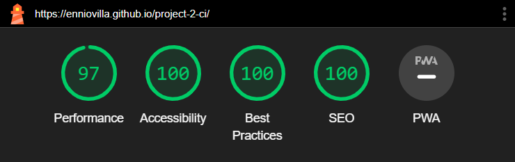

# Password Generator - Testing

Visit the deployed website here → [Password Generator](https://enniovilla.github.io/project-2-ci/index.html)

## Content

* [Testing User Stories](#testing-user-stories)
* [Manual Testing](#manual-testing)
    * [Browser Testing](#browser-testing)
* [Automated Testing](#automated-testing)
    * [HTML Validator](#html-validator)
    * [CSS Validator](#css-validator)
    * [JavaScript Validator](#javascript-validator)
    * [Lighthouse](#lighthouse)

## Testing User Stories

- First time visitors

| Expectation | Result |
| :--- | :--- |
| I want to create a strong and safe password. | I have created a website that is very easy to understand its purpose from the moment the page loads. |
| I want to save my passwords for future reference. | I have created an area where the user can save the passwords. |
| I want the website to have easy navigation. | I have created a single page website. The user just have to scroll down or click the buttons in the navigation bar. |
| I want responsiveness from my website. | The website has full responsiveness. |

- Returning Visitors

| Expectation | Result |
| :--- | :--- |
| I want to generate a new password. | The user can generate a new password with multiple characters within seconds. |
| I want to check my saved passwords. | The saved passwords are saved right below the password generator making it easier to find them. |

## Manual Testing

I tested all the buttons and links throughout the creation of the website and did a final test. The result of the final test is below.

| Feature | Expectation | Action | Result |
| :--- | :--- | :--- | :--- |
| Website's Logo | Refresh the page. | Clicked Logo. | Page reloads and goes back to the top. |
| Website's Title | Refresh the page. | Clicked Title. | Page reloads and goes back to the top. |
| Navigation bar buttons | Take the user to the respective section. | Clicked button. | Goes to respective section. |
| Password on the password output | Always have a password on the password output. | Refreshed page. | There is always a new password on the password output when the page is refreshed. |
| Stylized buttons | Change color when the mouse hovers on them.| Hovered mouse over buttons. | The color changes. |
| Generate button | Randomly generate a new password according to the length and character types chosen. | Generated passwords with different lengths and characters. | A new password is always generated. |
| Save Password button | Save the password in the area below the password generator. | Clicked saved password button. | The password is saved. |
| Save Password message | Pops up and alert informing the user that the password has been saved. | Clicked saved password button. | The message showed up. |
| Range bar | Change the password characters length as the range bar increases/decreases. | Increased/decreased the range bar. | The number of characters in the password changes. |
| Checkbox for specific characters | Select/unselect characters. | Selected/unselected the checkboxes. | The characters were selected/unselected. |
| Character types not selected | Show an alert informing the user to select a character type to generate a password. | Unselected all the checkboxes. | The alert pops up. |
| Delete All Passwords button | Delete all passwords at once. | Clicked button. | Deletes all passwords. |
| Delete All Passwords confirmation | A message pops up asking if the user wants to delete all passwords. | Clicked button. | The message pops up and deletes all passwords if confirmed, otherwise the message can be closed doing nothing. |
| Delete password button | Garbage bin icon on the right of a password. | Generate password. | The passwords have a garbage bin icon on their right. |
| Delete password confirmation | A message pops up asking if the user wants to delete the password. | Clicked delete icon. | The message pops up and deletes the password if confirmed, otherwise the message can be closed doing nothing. |
| Frequently Asked Questions accordion | Open and close the question window. | Clicked each accordion unit. | The message is opened/closed. |
| Social media links | Social media links should open externally. | Clicked on social media icons at the bottom of the page. | The links open externally. |

### Browser Testing

I tested the website in different browsers, both on computer and mobile.

| Browser | Result |
| :--- | :--- |
| Google Chrome | The website is responsive. |
| Microsoft Edge | The website is responsive. |
| Mozilla Firefox | The website is responsive. |
| Opera | The website is responsive. |
| Safari | The website is responsive. |

[Back to top](<#content>)

## Automated Testing

### HTML Validator
[W3C](https://validator.w3.org/) checked the HTML of the website and it passed the validation. A warning message shows up in due to importing the font from Google Fonts.
- [HTML validation](documentation/testing/html-validation.pdf)

### CSS Validator
The CSS was validated by [W3C Jigsaw](https://jigsaw.w3.org/css-validator/) and passed the test. To see the full result, click on the name below.
- [CSS](documentation/testing/css-validation.pdf)

### JavaScript Validator
[JSHint](https://jshint.com/) was used to validate the JavaScript. The validation passed.
- [JavaScript](documentation)

### Lighthouse

I used Lighthouse to test the full performance of the website.

- Mobile

- Desktop

[Back to top](<#content>)